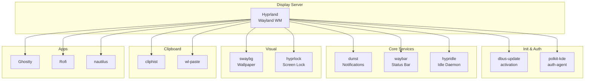
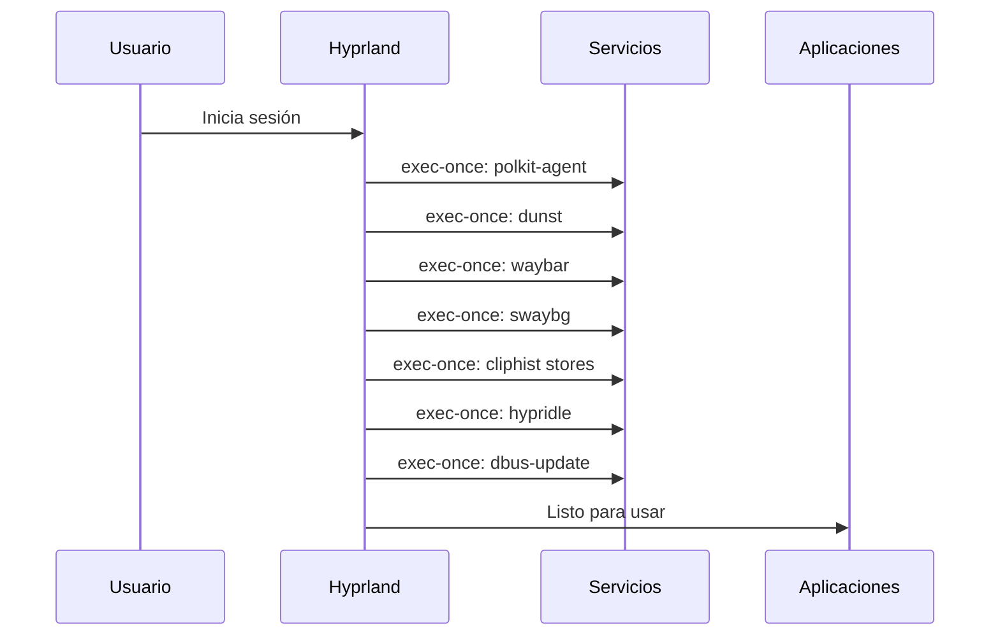

# Coffee Dev Dotfiles - Documentación

> Configuración personal de entorno de desarrollo para Fedora con Hyprland

## Tabla de Contenidos

1. [Arquitectura del Sistema](#arquitectura-del-sistema)
2. [Programas y Dependencias](#programas-y-dependencias)
3. [Hotkeys de Hyprland](#hotkeys-de-hyprland)
4. [Configuraciones de Shell](#configuraciones-de-shell)
5. [Waybar - Módulos](#waybar---módulos)
6. [Instalación](#instalación)

---

## Arquitectura del Sistema



### Flujo de Inicio



---

## Programas y Dependencias

### Window Manager

| Programa | Archivo | Descripción |
|----------|---------|------------|
| **Hyprland** | `.config/hypr/hyprland.conf` | Window Manager Wayland |
| **hypridle** | `.config/hypr/hypridle.conf` | Gestor de inactividad (auto-lock) |
| **hyprlock** | `.config/hypr/hyprlock.conf` | Pantalla de bloqueo |

### Shells

| Programa | Archivo | Plugins/Extensiones |
|----------|---------|---------------------|
| **Fish** | `.config/fish/config.fish` | fisher, done |
| **Bash** | `.bashrc` | pyenv, fnm, zoxide, starship |
| **Zsh** | `.zshrc` | fzf |

### Utilidades del Sistema

| Programa | Propósito | Dependencias |
|----------|----------|--------------|
| **Waybar** | Barra de estado superior | brightnessctl, pamixer, playerctl |
| **Dunst** | Demonio de notificaciones | wofi (para dmenu) |
| **Rofi** | Launcher / Powermenu | Múltiples themes |
| **swaybg** | Wallpaper | Imagen PNG/JPG |
| **grimblast** | Screenshots | grim, wl-copy |
| **flameshot** | Screenshots GUI | - |
| **wlogout** | Pantalla de logout | gtk3 |

### Gestión del Clipboard

| Programa | Propósito |
|----------|----------|
| **cliphist** | Historial del portapapeles |
| **wl-paste** | Clipboard Wayland |

### Editores y Terminal

| Programa | Archivo | Notas |
|----------|---------|-------|
| **Helix** | `.config/helix/config.toml` | Tema onedark |
| **Wezterm** | `.wezterm.lua` | - |
| **Neovim** | alias `vim` | - |
| **Ghostty** | - | Terminal por defecto |

---

## Hotkeys de Hyprland

> **Modificador principal:** `Super` (Tecla Windows)

### General

| Atajo | Acción |
|-------|--------|
| `Super + Return` | Abrir terminal (ghostty) |
| `Super + Q` | Cerrar ventana actual |
| `Super + M` | Salir de Hyprland (exit) |
| `Super + F` | Abrir explorador de archivos (nautilus) |
| `Super + Shift + F` | Pantalla completa |

### Aplicaciones

| Atajo | Acción |
|-------|--------|
| `Super + B` | Abrir navegador (Zen Browser) |
| `Super + P` | Abrir powermenu |
| `Super + O` | Abrir Obsidian |
| `Super + C` | Abrir editor (nvim) |
| `Super + A` | Abrir launcher (rofi) |
| `Super + E` | Emojipicker + copiar |

### Ventanas

| Atajo | Acción |
|-------|--------|
| `Super + W` | Toggle ventana flotante |
| `Super + J` | Toggle split (dwindle) |
| `Super + L` | Bloquear pantalla (hyprlock) |

### Movimiento y Tamaño

| Atajo | Acción |
|-------|--------|
| `Super + ←→↑↓` | Mover foco entre ventanas |
| `Super + Shift + ←→↑↓` | Mover ventana activo |
| `Super + Z` | Modo movimiento de ventana |
| `Super + X` | Modo redimensionado |
| `Super + Shift + ←→↑↓` | Redimensionar ventana (30px) |

### Workspaces

| Atajo | Acción |
|-------|--------|
| `Super + [1-0]` | Cambiar a workspace 1-10 |
| `Super + Shift + [1-0]` | Mover ventana a workspace |
| `Super + Shift + S` | Mover a special workspace (magic) |
| `Super + mouse scroll` | Scrollear workspaces |

### Screenshots

| Atajo | Acción |
|-------|--------|
| `Print` | Captura pantalla completa |
| `Super + Print` | Captura ventana activa |
| `Super + Alt + Print` | Captura área seleccionada |
| `Super + S` | Flameshot GUI |

### Audio y Media

| Atajo | Acción |
|-------|--------|
| `XF86AudioRaiseVolume` | Subir volumen +5% |
| `XF86AudioLowerVolume` | Bajar volumen -5% |
| `XF86AudioMute` | Silenciar |
| `XF86AudioPlay/Pause` | Play/Pause媒体 |
| `XF86AudioNext/Prev` | Siguiente/Anterior pista |

### Brillo

| Atajo | Acción |
|-------|--------|
| `XF86MonBrightnessUp` | Subir brillo +5% |
| `XF86MonBrightnessDown` | Bajar brillo -5% |

### Others

| Atajo | Acción |
|-------|--------|
| `Ctrl + Escape` | Toggle waybar |
| `Super + Escape` | Abrir wlogout |
| `Super + P` + `wl-copy` | Color picker |

---

## Configuraciones de Shell

### Fish Shell (`.config/fish/config.fish`)

```fish
# Variables de entorno
export PYENV_ROOT="$HOME/.pyenv"
export PATH="/home/jona/.local/share/fnm:$PATH"
fnm env --use-on-cd | source

# Inicializaciones
starship init fish
pyenv init -
zoxide init fish

# Aliases
alias ls='exa'
alias ll='exa -l'
alias la='exa -la'
alias vim='nvim'
alias pp='pnpm'
alias emacs='emacs -nw'
```

### Bash (`.bashrc`)

```bash
# Inicializaciones
eval "$(pyenv init -)"
eval "$(starship init bash)"
eval "$(zoxide init bash)"
. "$HOME/.cargo/env"

# fnm
export PATH="/home/jona/.local/share/fnm:$PATH"
eval "`fnm env`"
```

### Zsh (`.zshrc`)

> Configuración mínima - delega a Fig para el resto.

---

## Waybar - Módulos

### Configuración Actual

```json
{
    "modules-left": ["clock", "hyprland/workspaces"],
    "modules-center": ["hyprland/window"],
    "modules-right": [
        "tray", "memory", "cpu", "network",
        "battery", "backlight", "pulseaudio", "pulseaudio#microphone"
    ]
}
```

### Módulos Activos

| Módulo | Descripción | Atajos |
|--------|------------|--------|
| **clock** | Reloj con calendario | Scroll: cambiar mes |
| **hyprland/workspaces** | Workspaces de Hyprland | Click: ir a workspace |
| **hyprland/window** | Ventana activa | - |
| **tray** | Bandeja del sistema | - |
| **memory** | Uso de memoria RAM | - |
| **cpu** | Uso de CPU | - |
| **network** | Estado de red | - |
| **battery** | Batería | - |
| **backlight** | Brillo | Scroll: ajustar |
| **pulseaudio** | Volumen | Scroll: ajustar |
| **pulseaudio#microphone** | Micrófono | Scroll: ajustar |

---

## Instalación

### Requisitos Previos (Fedora)

```bash
# Wayland y Hyprland
sudo dnf install hyprland waybar dunst wofi rofi
sudo dnf install polkit-kde-authentication-agent-1

# Shells y herramientas
sudo dnf install fish bash zsh
sudo dnf install starship pyenv fnm zoxide fzf

# Editores y terminal
sudo dnf install ghostty neovim helix wezterm

# Utilidades
sudo dnf install brightnessctl pamixer playerctl grimblast flameshot
sudo dnf install cliphist wl-clippaste

# Dependencias de build (opcional)
sudo dnf install cargo python3 nodejs
```

### Instalación de Dotfiles

```bash
# Simbólicos
ln -sf ~/.dotfiles/.bashrc ~
ln -sf ~/.dotfiles/.zshrc ~
ln -sf ~/.dotfiles/.config/fish ~
ln -sf ~/.dotfiles/.config/hypr ~
ln -sf ~/.dotfiles/.config/waybar ~
ln -sf ~/.dotfiles/.config/dunst ~
ln -sf ~/.dotfiles/.config/rofi ~
ln -sf ~/.dotfiles/.config/helix ~
```

---

## Colores (Catppuccin Mocha)

| Nombre | Hex | Uso |
|--------|-----|-----|
| Rosewater | `#f5e0dc` | - |
| Flamingo | `#f2cdcd` | - |
| Pink | `#f5c2e7` | - |
| Mauve | `#cba6f7` | - |
| Red | `#f38ba8` | - |
| Maroon | `#e64553` | - |
| Peach | `#fab387` | Urgency critical |
| Green | `#a6e3a1` | - |
| Teal | `#94e2d5` | - |
| Sky | `#89dceb` | - |
| Sapphire | `#74c7ec` | - |
| Blue | `#89b4fa` | Bordes activos |
| Lavender | `#b4befe` | - |
| Text | `#cdd6f4` | Texto principal |
| Subtext1 | `#bac2de` | - |
| Subtext0 | `#a6adc8` | - |
| Overlay2 | `#9399b2` | - |
| Overlay1 | `#7f849c` | - |
| Overlay0 | `#6c7086` | - |
| Surface2 | `#585b70` | - |
| Surface1 | `#45475a` | - |
| Surface0 | `#313244` | Fondo base |
| Base | `#1e1e2e` | Fondo deep |
| Mantle | `#181825` | - |
| Crust | `#11111b` | - |

---

*Última actualización: 2026*